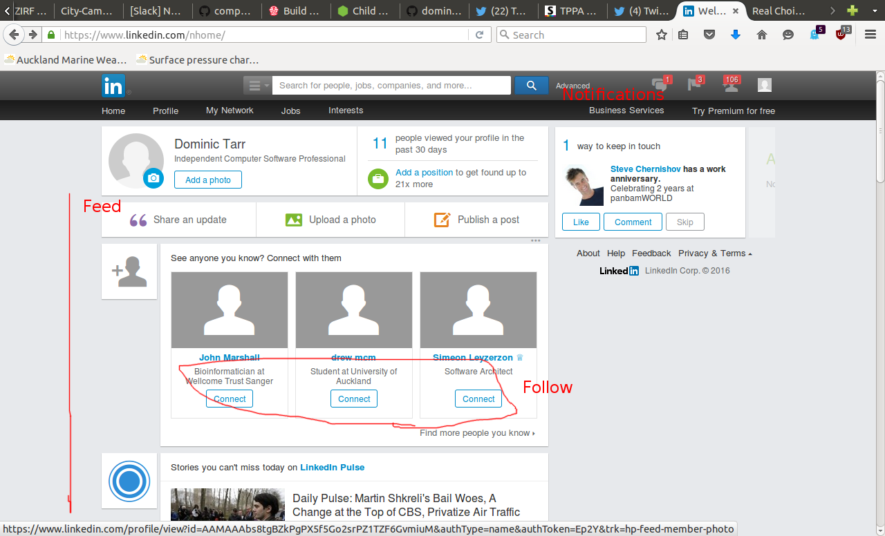
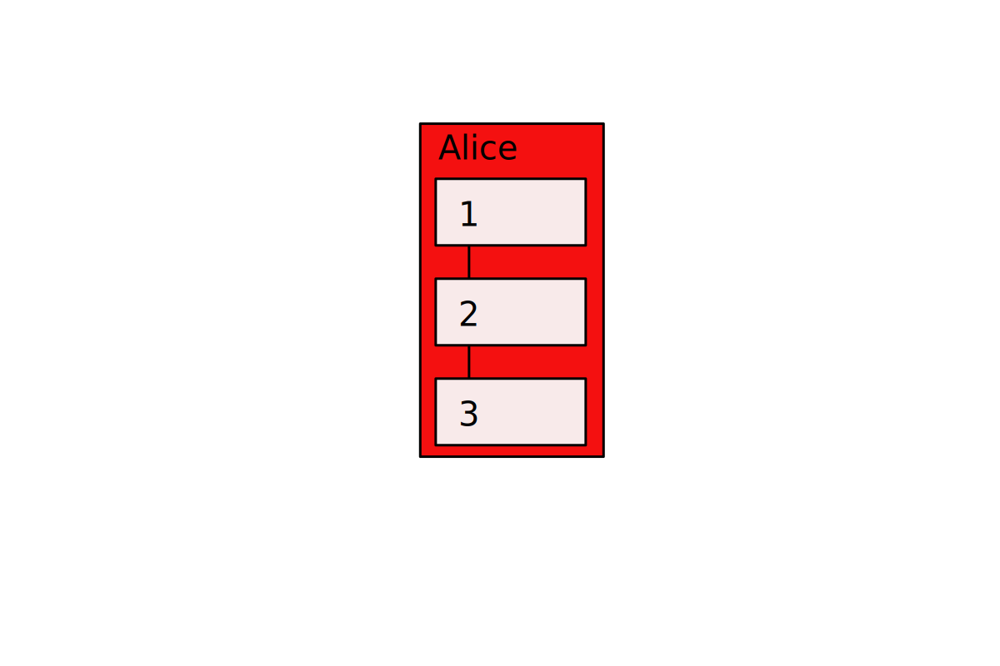
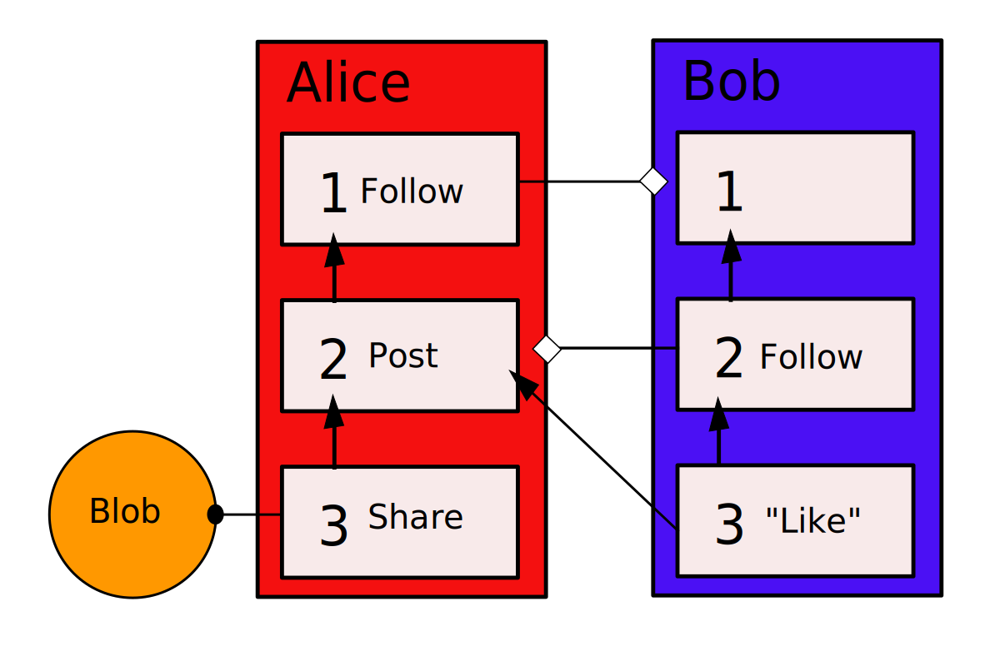
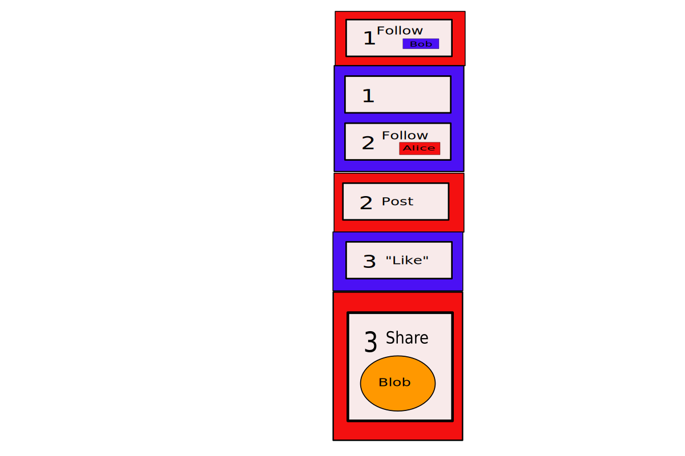
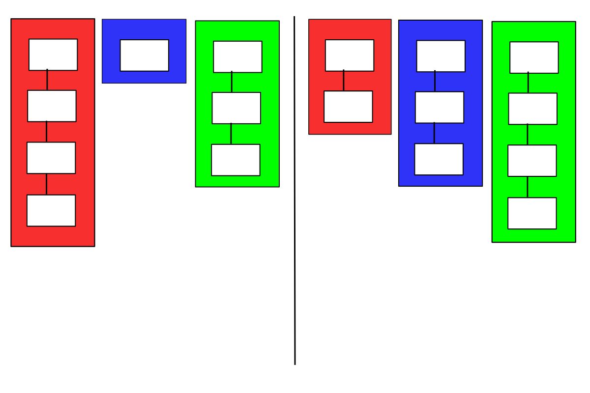
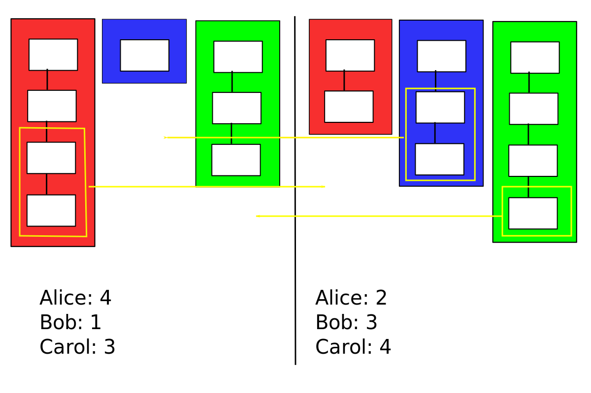
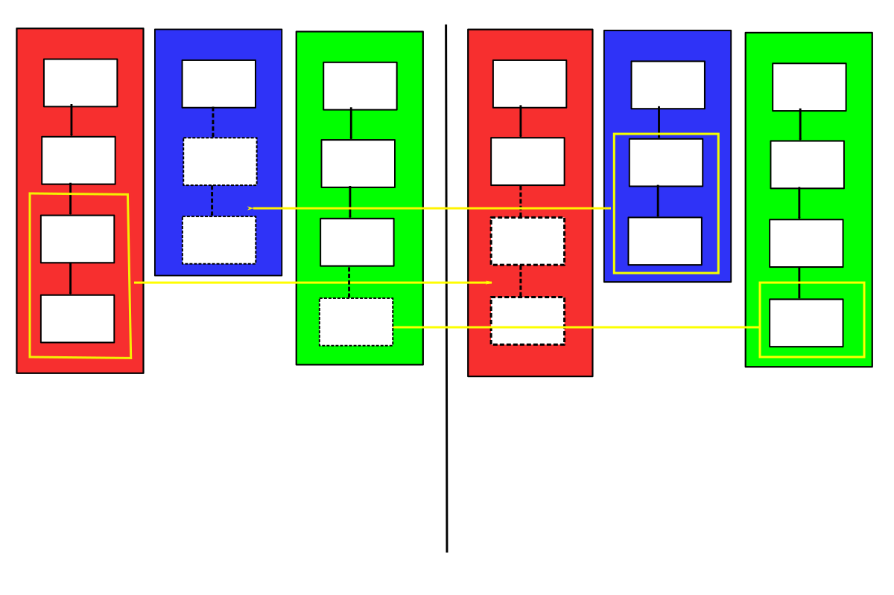

# SecureScuttlebutt: A Secure Gossip Protocol

* dominic.tarr@gmail.com
* @dominictarr
* @EMovhfIrFk4NihAKnRNhrfRaqIhBv1Wj8pTxJNgvCCY=.ed25519

---

# Brief History of the Internet

* 1969 - ARPANET (reliable network)
* 1983 - TCP/IP (unreliable network, smart end points)
* 1989 - World Wide Web (simple application protocol)
* 1994 - SSL (enables e-commerce)
* 1998 - Google
* 2004 - Facebook ("Web 2.0" era)

---

# Anatomy of A Web 2.0 Application

* content provided by "social network" of users
* friend/follow/connect
* newsfeeds
* notifications

---

---

---

---

# typical implementation

* centralized datacenters
* difficult scaling issues
* infrastructure investment

---

# vulnerabilitys of centralization

* Service Unreliability (downtime)
* Network Unreliability (can't connect)
* Service is Subverted/Lobbied/Hacked
* Service mutates (i.e. to monetize)

---

# A P2P Protocol for Web 2.0

* inverse scaling
* minimal resourcing
* inherently democratic ("vote" for protocol implementation by client)

---

---

---

---

---

---

---

# technical advantages

* offline usability
* very low SLA
* relays can't interfer
* sneakernet compatible
* open data

---

# representing web 2.0 concepts p2p

---

# Follow

* link to other's public key

---

# recommendations

* replicate friends of friend's data

---

# user discovery

* via social recommendation

---

# private messages

* encrypted messages

---

# user names

* pet names
* transitive scoring of name mapping (a la pagerank)

---

# key revocation

* social trust signals (other users flag account)

---

# moderation

* can't moderate from central point, must provide tools for self-moderation.

---

# internet future history?

* secured data, unreliable hosts

* other projects: bittorrent, CBN, bitcoin, ipfs, ethereum

